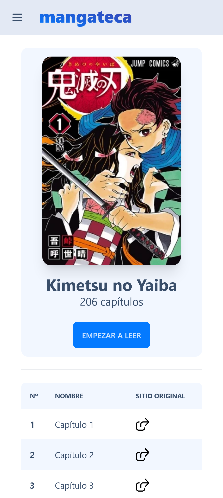

# Mangateca

Progressive Web App (PWA) to read manga in spanish using my API [man-go](<https://github.com/la-lo-go/man-go>)

| PC                                               | Mobile                                                  |
| ------------------------------------------------ | ------------------------------------------------------- |
|    |    |
|  |  |
|   |   |
|  |  |

## Development

### Create the .env file

Create a .env file in the root of the project with the `SERVER_URL`, the [man-go API](<https://github.com/la-lo-go/man-go>).

```bash
SERVER_URL = http://localhost:7070 
```

### Run

```bash
npm install
npm run dev
```

## LICENSE

[](LICENSE)
